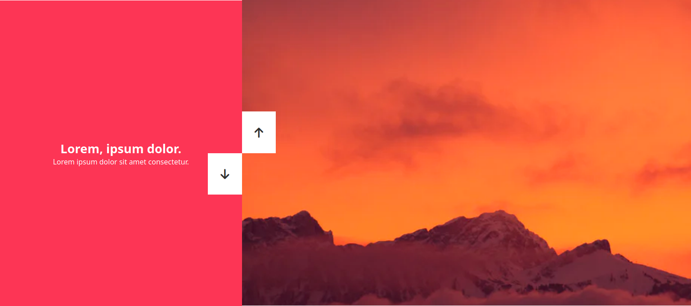

# switch screen vertical

## test url
https://htmlpreview.github.io/?https://github.com/CodingBDX/javascript/blob/main/prototype/double-verticale/index.html

## event on click

```css

const changeSlide = (direction) => {
    const slideHeight = sliderContainer.clientHeight;

    if(direction === 'up') {
        activeSlideIndex++;
        if(activeSlideIndex > slidesLength -1) {
activeSlideIndex = 0
        }
    }

else if(direction === 'down') {
        activeSlideIndex--;
        if(activeSlideIndex < 0) {
activeSlideIndex = slidesLength -1;
        }
    }

    rightSlide.style.transform = `translateY(-${activeSlideIndex * slideHeight}px)`
    leftSlide.style.transform = `translateY(${activeSlideIndex * slideHeight}px)`

}

```

on va ecouter la direction prise par rapport au bouton cliqué, du coup on va soustraire la hauteur 100vh pour changer de DIV qui inclus tous les background-image, et on fait une petite boucle quand on arrive au dernier, on retourne au premier


